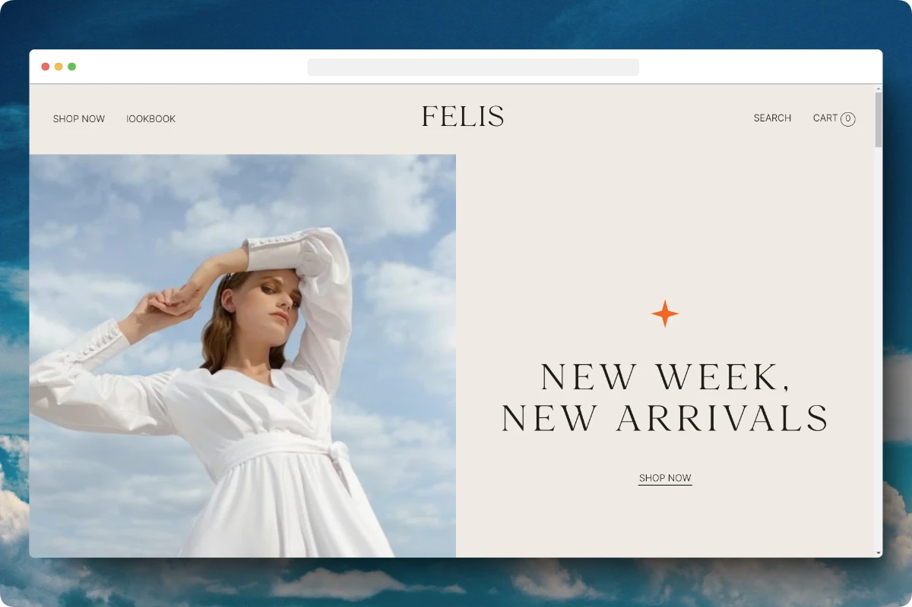

# [migueweb.github.io/felis](https://migueweb.github.io/felis)

## Description

Pretty landingpage for a fictional company called Felis. Made with HTML, SCSS and some JavaScript.

## Installation

### Prerequisites

- [NPM](https://nodejs.org/en/)
- [Live server](https://marketplace.visualstudio.com/items?itemName=ritwickdey.LiveServer) VSCode extension (optional)

1. Clone the repository `git clone https://github.com/migueweb/felis.git`
2. Install dependencies `npm install`

3. Run the project `npm run dev`

4. Run Live server
5. Open your browser and go to `http://localhost:5500`
6. Happy coding! 🐱‍💻

## Authors

- Design by [Rayane Saada](https://dub.sh/figma-felis)
- Code by [@migueweb](github.com/migueweb)
